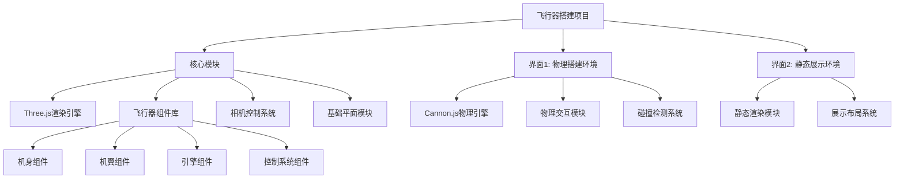

# DESIGN_3D空间界面

## 整体架构设计

### 系统架构图


## 分层设计

### 1. 核心层 (Core Layer)
- **Three.js渲染引擎**：负责3D场景的渲染和基础功能
- **飞行器组件库**：预定义的飞行器部件（机身、机翼、引擎等）
- **相机控制系统**：统一的相机操作（旋转、缩放、平移）
- **基础平面模块**：Z=0平面的创建和管理

### 2. 界面层 (Interface Layer)
#### 界面1：物理搭建环境
- **Cannon.js集成**：物理引擎的初始化和配置
- **物理交互模块**：处理重力、碰撞、力等物理效果
- **碰撞检测系统**：组件间的碰撞检测和响应

#### 界面2：静态展示环境
- **静态渲染模块**：纯展示模式的渲染优化
- **展示布局系统**：飞行器组件的静态排列算法

### 3. 组件层 (Component Layer)
- **机身组件**：主体结构，包含多个连接点
- **机翼组件**：飞行控制面，可调整角度
- **引擎组件**：动力系统，可配置推力
- **控制系统组件**：导航和操控设备

## 模块依赖关系

### 核心依赖
```
界面1/界面2 → 核心模块 → Three.js
界面1 → Cannon.js
```

### 数据流向
1. **用户操作** → 界面层 → 核心层 → 渲染引擎
2. **物理模拟** → 物理引擎 → 界面1 → 渲染更新
3. **组件放置** → 组件库 → 界面层 → 场景更新

## 接口契约定义

### 核心模块接口
```javascript
// 场景管理
class SceneManager {
    createScene(): THREE.Scene
    addObject(object: THREE.Object3D): void
    removeObject(object: THREE.Object3D): void
}

// 相机控制
class CameraController {
    setupCamera(): THREE.PerspectiveCamera
    enableOrbitControls(): void
    setCameraPosition(x, y, z): void
}

// 基础平面
class GroundPlane {
    createPlane(): THREE.Mesh
    setGridVisibility(visible: boolean): void
}
```

### 飞行器组件接口
```javascript
// 基础组件
class AircraftComponent {
    constructor(type: string, config: object)
    createMesh(): THREE.Mesh
    getPosition(): THREE.Vector3
    setPosition(x, y, z): void
    connectTo(other: AircraftComponent): boolean
}

// 物理组件（界面1专用）
class PhysicsComponent extends AircraftComponent {
    createPhysicsBody(): CANNON.Body
    applyForce(force: CANNON.Vec3): void
    updatePhysics(): void
}
```

### 界面专用接口
```javascript
// 界面1：物理环境
class PhysicsEnvironment {
    setupPhysicsWorld(): void
    addPhysicsObject(component: PhysicsComponent): void
    simulatePhysics(): void
}

// 界面2：静态环境
class StaticEnvironment {
    setupStaticScene(): void
    arrangeComponents(components: AircraftComponent[]): void
}
```

## 技术实现细节

### 性能优化策略
1. **对象池管理**：复用3D对象，减少内存分配
2. **LOD（层次细节）**：根据距离调整模型细节
3. **渲染优化**：视锥体裁剪，只渲染可见对象
4. **物理优化**：合理的模拟步长和碰撞精度

### 错误处理机制
1. **WebGL兼容性检查**：自动检测浏览器支持
2. **资源加载监控**：处理模型加载失败情况
3. **物理引擎错误恢复**：防止物理模拟崩溃
4. **用户反馈系统**：友好的错误提示

### 扩展性设计
1. **插件式架构**：易于添加新的飞行器组件
2. **配置驱动**：通过配置文件调整界面参数
3. **事件系统**：松耦合的组件通信机制
4. **工具链集成**：支持开发调试工具

## 文件结构设计
```
src/
├── core/                    # 核心模块
│   ├── scene-manager.js
│   ├── camera-controller.js
│   ├── ground-plane.js
│   └── aircraft-components/
│       ├── base-component.js
│       ├── fuselage.js
│       ├── wing.js
│       └── engine.js
├── interfaces/              # 界面模块
│   ├── physics-environment/
│   │   ├── physics-world.js
│   │   ├── physics-component.js
│   │   └── collision-system.js
│   └── static-environment/
│       ├── static-scene.js
│       └── layout-system.js
├── utils/                   # 工具函数
│   ├── math-utils.js
│   ├── debug-utils.js
│   └── event-system.js
└── pages/                   # 界面文件
    ├── physics-builder.html
    └── static-showcase.html
```

这个架构设计确保了系统的稳定性、可扩展性和可维护性，同时满足了两个3D界面的差异化需求。